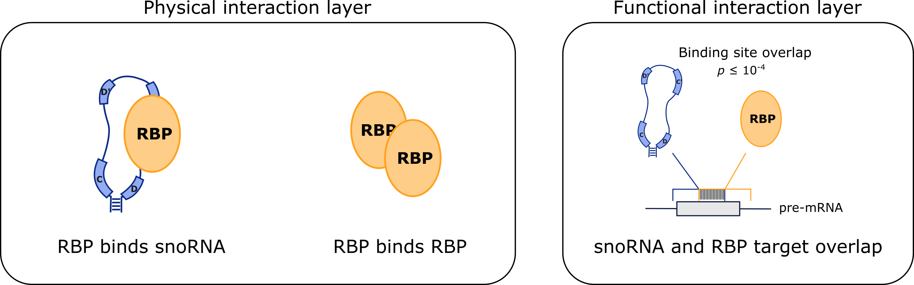

# **snoFlake**: snoRNA Functional Interaction Network Model

<p align="center">
  
</p>

A Snakemake pipeline to gather snoRNA–RNA-binding protein (RBP) interactions from multiple sources and construct a snoRNA–RBP interaction network for visualization and analysis in Cytoscape.

**Author:** [Kristina Sungeun Song](mailto:kristina.song@usherbrooke.ca)  

---

## Table of Contents

- [Overview](#overview)
- [Installation and Environment Setup](#installation-and-environment-setup)
- [Running the Snakemake Workflow](#running-the-snakemake-workflow)
- [Step 0: Configure the Pipeline](#step-0-configure-the-pipeline)
- [Step 1: Get Input Datasets](#step-1-get-input-datasets)
- [Step 2: Compute snoRNA–RBP Interactions](#step-2-compute-snorna-rbp-interactions)
- [Step 3: Build snoFlake Network in Cytoscape](#step-3-build-snoflake-network-in-cytoscape)
- [Citation](#citation)

---

## Overview

snoFlake is a reproducible bioinformatics pipeline that integrates multiple types of snoRNA–RBP interaction evidence to build a comprehensive interaction network. The pipeline collects and processes data from eCLIP-seq experiments (ENCODE), computationally predicted snoRNA-RNA interactions (snoGloBe), and other interaction sources, computes interaction scores, and outputs network files ready for visualization in Cytoscape.

**Types of snoRNA–RBP Interactions integrated by snoFlake:**

<p align="center">
  
</p>

---

## Installation and Environment Setup and Environment Setup

snoFlake is supported on **Linux** (tested on Ubuntu).

### 1. Clone the repository

```bash
git clone https://github.com/scottgroup/snoFlake.git
cd snoFlake
```

### 2. Install Snakemake

We recommend installing Snakemake via [Conda/Mamba](https://github.com/conda-forge/miniforge). Please follow the [official Snakemake installation instructions](https://snakemake.readthedocs.io/en/stable/getting_started/installation.html).

```bash
mamba create -c conda-forge -c bioconda -n snakemake snakemake=7.32.4
conda activate snakemake
```

> This workflow has been tested with Snakemake **v7.32.4**.

### 3. Install rule-level dependencies

Each rule in the workflow uses a dedicated Conda environment defined in `workflow/envs/`. Snakemake will automatically install these when you use the `--use-conda` flag (recommended).

---

## Running the Snakemake Workflow

First, perform a **dry run** to verify that the workflow is correctly configured and all input files are accessible:

```bash
# Run from the root snoFlake/ directory
snakemake -n
```

To execute the workflow, choose the appropriate profile for your system:

```bash
# On a SLURM cluster
snakemake --profile profile_slurm

# On a local machine
snakemake --profile profile_local
```

To enable automatic Conda environment management per rule:

```bash
snakemake --profile profile_slurm --use-conda
```

---

## Configure the Pipeline

Before running the workflow, edit the main configuration file at `config/config.yaml`.

---

### Output interaction table

The pipeline produces a scored, tab-separated interaction table with one row per snoRNA–RBP pair as well as a Cytoscape session of the network. We recommend the **Degree-sorted Circular Layout** for visualizing large snoRNA–RBP networks. Node and edge attributes exported from the pipeline can be used to color or size nodes by snoRNA class, RBP function, or interaction score.

---

## Citation

If you use snoFlake in your research, please cite:

```
Song, K. S., Cyr, M., Faucher-Giguère, L., Yeo, B., Seow, V. K., Deschamps-Francoeur, G., Abou Elela, S., & Scott, M. S. (2026).
snoFlake: A network model for snoRNA–RBP complexes reveals SNORD22 as a U5 snRNP-associated splicing regulator. bioRxiv.
https://doi.org/10.64898/2026.04.02.716167
```

---

*For questions or issues, please open a GitHub Issue or contact [kristina.song@usherbrooke.ca](mailto:kristina.song@usherbrooke.ca).*
